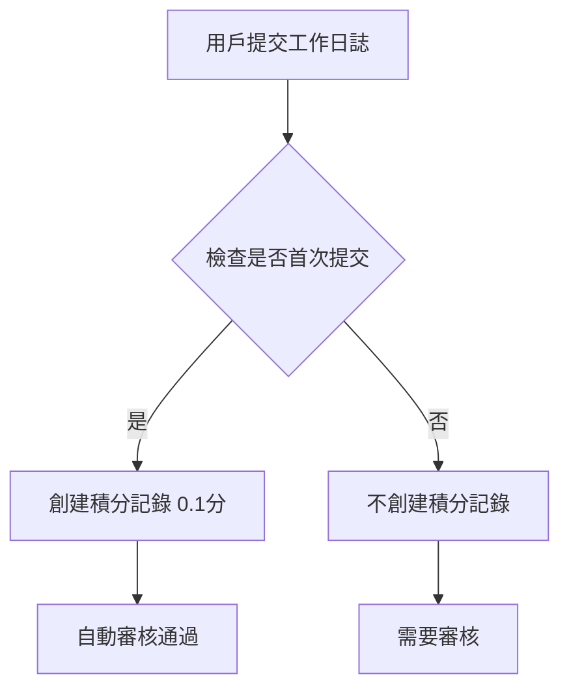
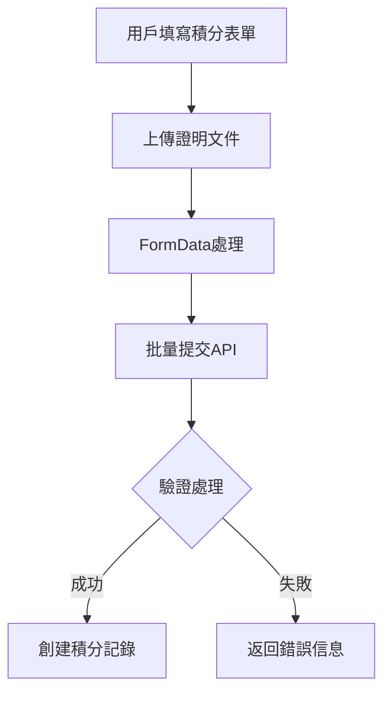

# 工作日誌積分與積分表單提交功能優化說明

## 更新日期：2025-09-24

## 核心功能修改摘要

### ✅ 工作日誌功能優化
1. 首次填寫自動加分（0.1分）
2. 同日多次填寫不重複計算天數
3. 編輯需要審核且不重複加分

### ✅ 積分表單提交功能修復
1. 解決大型請求限制問題
2. 優化多文件上傳處理
3. 改進錯誤處理機制

## 一、檔案修改對應關係

### 1. 後端修改（Backend）

#### 1.1 WorkLogService.cs
```csharp
// 路徑: PointsManagementAPI/Services/WorkLogService.cs
// 主要修改:

// 1. 積分設置修改
public async Task<WorkLog> CreateWorkLogAsync(WorkLog workLog)
{
    // [修改前] StandardId = 6, BasePoints = 1.0m
    var pointsEntry = new PointsEntry
    {
        StandardId = 41,        // [修改後] 使用工作日誌積分項目
        BasePoints = 0.1m,      // [修改後] 調整為0.1分
        PointsEarned = 0.1m     // [修改後] 調整為0.1分
    };
}

// 2. 重複提交檢查邏輯
var existingApprovedLog = await _context.WorkLogs
    .Where(w => w.EmployeeId == workLog.EmployeeId)
    .Where(w => w.LogDate.Date == logDate)
    .Where(w => w.Status == "auto_approved" || w.Status == "approved")
    .AnyAsync();

var existingPointsEntry = await _context.PointsEntries
    .Where(p => p.EmployeeId == workLog.EmployeeId)
    .Where(p => p.EntryDate.Date == logDate)
    .Where(p => p.Description.Contains("工作日誌"))
    .AnyAsync();

// 3. 編輯狀態保持
public async Task<WorkLog> UpdateWorkLogAsync(WorkLog workLog)
{
    var originalStatus = existingLog.Status;
    var originalPoints = existingLog.PointsClaimed;
    
    existingLog.Status = originalStatus;        // 保持原狀態
    existingLog.PointsClaimed = originalPoints; // 保持原積分
}
```

#### 1.2 Program.cs
```csharp
// 路徑: PointsManagementAPI/Program.cs
// 主要修改:

// 1. 請求大小限制配置
builder.Services.Configure<IISServerOptions>(options =>
{
    options.MaxRequestBodySize = 104857600; // 100MB
});

builder.Services.Configure<FormOptions>(options =>
{
    options.MultipartBodyLengthLimit = 104857600;
    options.ValueLengthLimit = 104857600;
    options.MultipartHeadersLengthLimit = 104857600;
});

// 2. Kestrel服務器配置
builder.WebHost.ConfigureKestrel(serverOptions =>
{
    serverOptions.Limits.MaxRequestBodySize = 104857600;
    serverOptions.Limits.MaxRequestBufferSize = 104857600;
});

// 3. 錯誤處理配置
builder.Services.AddControllers(options =>
{
    options.MaxValidationDepth = 32;
}).ConfigureApiBehaviorOptions(options =>
{
    options.InvalidModelStateResponseFactory = actionContext =>
        new BadRequestObjectResult(new
        {
            Status = 400,
            Errors = actionContext.ModelState
                .Where(e => e.Value.Errors.Count > 0)
                .ToDictionary(
                    kvp => kvp.Key,
                    kvp => kvp.Value.Errors.Select(e => e.ErrorMessage).ToArray()
                )
        });
});
```

### 2. 前端修改（Frontend）

#### 2.1 pointsAPI.js
```javascript
// 路徑: src/services/pointsAPI.js
// 主要修改:

// 1. 檔案上傳處理優化
async submitBatchPoints(data) {
    const formData = new FormData();
    
    // 基本資料處理
    formData.append('employeeId', data.employeeId.toString());
    formData.append('submissionDate', data.submissionDate);
    formData.append('status', data.status || 'pending');
    formData.append('totalPoints', data.totalPoints.toString());
    
    // 檔案處理優化
    if (data.files && Object.keys(data.files).length > 0) {
        Object.entries(data.files).forEach(([itemId, fileArray]) => {
            const actualIndex = itemIndexMap[itemId];
            if (actualIndex !== undefined) {
                fileArray.forEach((file, fileIndex) => {
                    const fileKey = `g${actualIndex + 1}_${fileIndex}`;
                    formData.append('files', file);
                    formData.append('fileKeys', fileKey);
                });
            }
        });
    }
}
```

#### 2.2 InteractivePointsForm.js
```javascript
// 路徑: src/components/PointsManagement/EmployeePanel/InteractivePointsForm.js
// 主要修改:

// 1. 表單提交處理
const handleSubmit = async () => {
    const submissionData = {
        employeeId: employeeId,
        submissionDate: new Date().toISOString(),
        items: formData,
        files: uploadedFiles,
        totalPoints: totalPoints,
        status: 'pending'
    };

    try {
        const result = await pointsAPI.submitBatchPoints(submissionData);
        // 提交成功處理...
    } catch (error) {
        // 錯誤處理優化...
    }
};

// 2. 檔案上傳處理
const handleFileUpload = async (itemId, files) => {
    const fileArray = Array.from(files);
    setUploadedFiles(prev => ({
        ...prev,
        [itemId]: [...(prev[itemId] || []), ...fileArray]
    }));
};
```

## 二、數據流程說明

### 1. 工作日誌提交流程


### 2. 積分表單提交流程


## 三、配置參數說明

### 1. 工作日誌積分配置
| 參數 | 值 | 說明 |
|------|-----|------|
| StandardId | 41 | 工作日誌積分項目ID |
| BasePoints | 0.1 | 首次提交基礎積分 |
| Status | "approved" | 自動審核通過狀態 |

### 2. 系統限制配置
| 參數 | 值 | 說明 |
|------|-----|------|
| MaxRequestBodySize | 100MB | 請求體大小限制 |
| MultipartBodyLengthLimit | 100MB | 多部分表單限制 |
| MaxRequestBufferSize | 100MB | 請求緩衝區限制 |

## 四、測試要點

### 1. 工作日誌功能測試
- [ ] 首次提交自動加0.1分
- [ ] 同一天重複提交不重複加分
- [ ] 編輯工作日誌不影響已獲得積分
- [ ] 檢查積分記錄顯示正確的項目名稱

### 2. 積分表單提交測試
- [ ] 測試大型請求（接近100MB）
- [ ] 測試多文件上傳
- [ ] 驗證錯誤處理機制
- [ ] 檢查批量提交功能

## 五、注意事項

1. 部署前檢查項目
   - 確認資料庫中StandardId=41的積分項目存在
   - 檢查IIS和Kestrel配置是否正確
   - 驗證文件上傳目錄權限

2. 潛在問題
   - 大量文件上傳可能影響性能
   - 需要定期清理上傳文件
   - 考慮實現分批上傳機制

## 六、後續優化建議

1. 性能優化
   - 實現分批上傳機制
   - 添加文件壓縮功能
   - 優化數據庫查詢

2. 功能增強
   - 添加積分項目數量限制
   - 實現文件預覽功能
   - 添加批量審核功能

3. 監控優化
   - 添加性能監控
   - 實現錯誤日誌記錄
   - 添加用戶操作審計