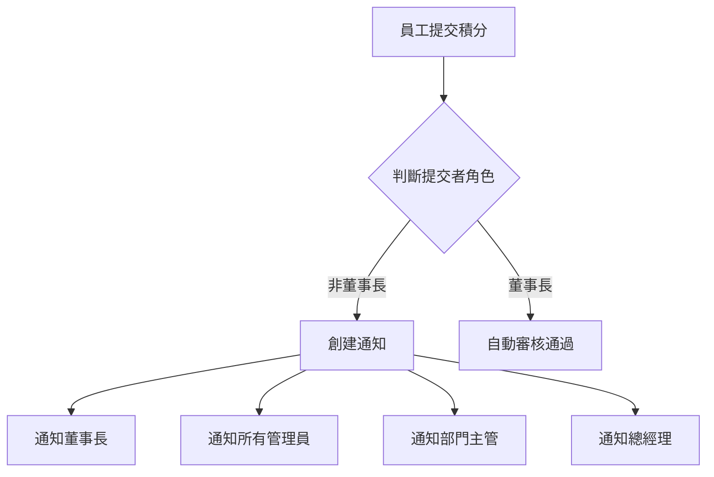

# 管理員權限提升與董事長級別功能實現說明文件

## 更新日期：2025-09-24

## 一、需求概述

將管理員(admin)角色的權限提升至與董事長(boss)相同級別，包括：
1. 可以審核全部部門員工的積分
2. 收到所有部門的積分提交通知
3. 積分提交自動審核通過
4. 可以查看全公司數據

## 二、修改檔案清單

### 後端修改
1. `PointsManagementAPI/Services/ReviewPermissionService.cs`
   - 權限檢查邏輯修改
   - 審核範圍擴展

2. `PointsManagementAPI/Controllers/PointsController.cs`
   - 通知邏輯修改
   - 管理員通知範圍擴展

### 前端修改
無需修改前端代碼，因為前端已經基於後端權限響應式顯示功能。

## 三、具體修改內容

### 1. ReviewPermissionService.cs 修改

#### 1.1 修改前代碼
```csharp
// 管理員可以審核同部門的員工和主管
if (reviewer.Role == "admin")
    return (entryOwner.Role == "employee" || entryOwner.Role == "manager") &&
           entryOwner.DepartmentId == reviewer.DepartmentId;
```

#### 1.2 修改後代碼
```csharp
// 管理員擁有與董事長相同的權限
if (reviewer.Role == "admin")
    return true; // 可以審核所有人
```

#### 1.3 修改原因
- 移除管理員只能審核同部門的限制
- 賦予管理員與董事長相同的審核權限
- 簡化權限檢查邏輯

### 2. PointsController.cs 修改

#### 2.1 通知邏輯修改
```csharp
// 修改前：限制在同部門
var departmentAdminsDebug = await _context.Employees
    .Where(e => e.DepartmentId == submitter.DepartmentId && 
               e.Role == "admin" && 
               e.IsActive && 
               e.Id != submitter.Id)
    .Select(e => new { e.Id, e.Name, e.Role, e.DepartmentId })
    .ToListAsync();

// 修改後：移除部門限制
var departmentAdminsDebug = await _context.Employees
    .Where(e => e.Role == "admin" && 
               e.IsActive && 
               e.Id != submitter.Id)
    .Select(e => new { e.Id, e.Name, e.Role, e.DepartmentId })
    .ToListAsync();
```

#### 2.2 修改原因
- 擴大管理員的通知範圍
- 確保管理員能收到所有部門的積分提交通知
- 與董事長保持相同的通知級別

## 四、功能影響範圍

### 1. 權限擴展
- 管理員現在可以審核任何部門的積分提交
- 不再受限於同部門限制
- 擁有與董事長相同的審核權限

### 2. 通知機制
- 管理員將收到所有部門的積分提交通知
- 通知即時性與董事長相同
- 通知內容包含完整的提交信息

### 3. 審核流程
- 管理員可以直接審核任何部門的積分
- 審核結果立即生效
- 無需額外的權限驗證

## 五、系統架構影響

### 1. 權限層級
```
修改前的層級結構：
- 董事長：全公司權限
- 總經理：除董事長外的全公司權限
- 管理員：本部門權限
- 部門主管：本部門權限
- 一般員工：僅個人權限

修改後的層級結構：
- 董事長/管理員：全公司權限
- 總經理：除董事長外的全公司權限
- 部門主管：本部門權限
- 一般員工：僅個人權限
```

### 2. 通知流程


## 六、測試要點

### 1. 權限測試
- 管理員審核其他部門積分
- 管理員查看全公司數據
- 管理員審核高級別人員積分

### 2. 通知測試
- 確認管理員收到全部門通知
- 驗證通知即時性
- 檢查通知內容完整性

### 3. 審核流程測試
- 管理員跨部門審核
- 審核結果更新
- 相關方通知送達

## 七、注意事項

1. 系統安全性
   - 確保管理員帳號安全
   - 定期審查權限使用情況
   - 記錄重要操作日誌

2. 性能考慮
   - 通知發送優化
   - 權限檢查快取
   - 數據庫查詢優化

3. 用戶體驗
   - 保持介面一致性
   - 清晰的權限提示
   - 操作反饋即時性

## 八、後續優化建議

1. 權限管理優化
   - 添加權限使用日誌
   - 實現權限委派機制
   - 細化權限控制

2. 通知機制優化
   - 添加通知分類
   - 實現通知優先級
   - 支援批量處理

3. 審核流程優化
   - 添加審核意見模板
   - 實現批量審核
   - 優化審核歷史記錄

## 九、相關文件

1. 資料庫結構
   - 使用現有的 Employees 表
   - 利用現有的 Role 欄位
   - 無需修改資料庫結構

2. API 文檔
   - 權限相關 API 保持不變
   - 通知相關 API 保持不變
   - 僅修改內部邏輯

## 十、回滾計劃

如需回滾修改：
1. 恢復 ReviewPermissionService.cs 的原始代碼
2. 恢復 PointsController.cs 中的通知邏輯
3. 重新啟動後端服務

## 十一、聯繫方式

如有問題請聯繫：
- 系統管理員
- 技術支援團隊
- 專案負責人
